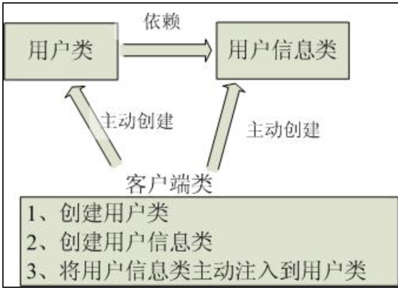
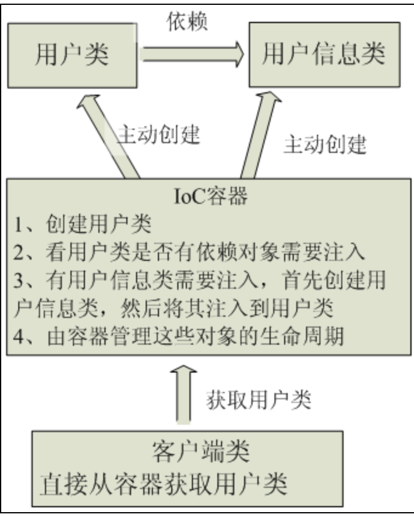

# IOC

##1.控制反转的概念
Ioc—Inversion of Control，即“控制反转”，是一种设计思想。Ioc意味着将你设计好的对象交给容器控制，而不是传统的在你的对象内部直接控制。
>(1)传统Java SE程序设计，我们直接在对象内部通过new进行创建对象，**是程序主动去创建依赖对象**；而**IoC是有专门一个容器来创建这些对象，即由Ioc容器来控制对 象的创建**；IoC 容器控制了对象,主要控制了外部资源获取（不只是对象包括比如文件等）,从而能够实现控制反转。

 
>反转则是由容器来帮忙创建及注入依赖对象；为何是反转？因为由容器帮我们查找及注入依赖对象，对象只是**被动的接受依赖对象**，所以是反转；哪些方面反转了？依赖对象的获取被反转了。
>

 

##2.好处
能够帮助设计出松耦合、更优良的程序。传统应用程序都是由我们在类内部主动创建依赖对象，从而导致类与类之间高耦合，难于测试；有了IoC容器后，把创建和查找依赖对象的控制权交给了容器，由容器进行注入组合对象，所以对象与对象之间是 松散耦合，这样也方便测试，利于功能复用，更重要的是使得程序的整个体系结构变得非常灵活。
## 3.IOC和DI
DI—Dependency Injection，即“依赖注入”：组件之间依赖关系由容器在运行期决定，形象的说，即**由容器动态的将某个依赖关系注入到组件之中**。依赖注入的目的并非为软件系统带来更多功能，而是为了提升**组件重用的频率**，并为系统搭建一个灵活、可扩展的平台。通过依赖注入机制，我们只需要通过简单的配置，而无需任何代码就可指定目标需要的资源，完成自身的业务逻辑，而不需要关心具体的资源来自何处，由谁实现。

　　理解DI的关键是：“**谁依赖谁，为什么需要依赖，谁注入谁，注入了什么**”，那我们来深入分析一下：

- 谁依赖于谁：当然是应用程序依赖于IoC容器；
- 为什么需要依赖：应用程序需要IoC容器来提供对象需要的外部资源；
- 谁注入谁：很明显是IoC容器注入应用程序某个对象，应用程序依赖的对象；
- 注入了什么：就是注入某个对象所需要的外部资源（包括对象、资源、常量数据）。

# AOP
在OOP设计中，它导致了**大量代码的重复，而不利于各个模块的重用**。AOP解开封装的对象内部，并将那些影响了多个类的公共行为**封装到一个可重用模块**，并将其名为“Aspect”，即切面。
AOP把软件系统分为两个部分：**核心关注点和横切关注点**。
>(1)业务处理的主要流程是核心关注点，与之关系不大的部分是横切关注点。
>(2)横切关注点的一个特点是，他们经常发生在核心关注点的多处，而各处都基本相似。比如权限认证、日志、事务处理。

### 实现AOP的技术，主要分为两大类：
> (1)动态代理技术，利用拦截方法的方式，对该方法进行装饰，以取代原有对象行为的执行；
> (2)静态织入的方式，引入特定的语法创建“切面”，从而使得编译器可以在编译期间织入有关“切面”的代码。

##AOP相关术语
###（1）切面（Aspect）
横切关注点的**模块化**（跨越应用程序多个模块的功能，比如 日志功能），这个关注点实现可能另外横切多个对象。
###（2）连接点（Join point）
连接点是在应用执行过程中能够插入切面的一个点。这个点可以是类的某个方法调用前、调用后、方法抛出异常后等。切面代码可以利用这些点插入到应用的正常流程之中，并添加行为。
###（3）通知（Advice）
在特定的连接点，AOP框架执行的动作。
Spring AOP 提供了5种类型的通知：

- 前置通知（Before）：在目标方法被调用之前调用通知功能。
- 后置通知（After）：在目标方法完成之后调用通知，无论该方法是否发生异常。
- 后置返回通知（After-returning）：在目标方法成功执行之后调用通知。
- 后置异常通知（After-throwing）：在目标方法抛出异常后调用通知。
- 环绕通知（Around）：通知包裹了被通知的方法，在被通知的方法调用之前和调用之后执行自定义的行为。

###（4）切点（Pointcut）
指定一个通知将被引发的一系列连接点的集合。AOP 通过切点定位到特定的连接点。切点和连接点不是一对一的关系，一个切点匹配多个连接点，切点通过 org.springframework.aop.Pointcut 接口进行描述，它使用类和方法作为连接点的查询条件。每个类都拥有多个连接点，例如 ArithmethicCalculator类的所有方法实际上都是连接点。
###（5）引入（Introduction）
添加方法或字段到被通知的类。 Spring允许引入新的接口到任何被通知的对象。例如，你可以使用一个引入使任何对象实现 IsModified接口，来简化缓存。Spring中要使用Introduction, 可有通过DelegatingIntroductionInterceptor来实现通知，通过DefaultIntroductionAdvisor来配置Advice和代理类要实现的接口
###（6）目标对象（Target Object）
包含连接点的对象。也被称作被通知或被代理对象。
###（7）AOP代理（AOP Proxy）
AOP框架创建的对象，包含通知。 在Spring中，AOP代理可以是JDK动态代理或者CGLIB代理。
###（8）织入(Weaving)
织入描述的是把切面应用到目标对象来创建新的代理对象的过程。 Spring AOP 的切面是在运行时被织入，原理是使用了动态代理技术。Spring支持两种方式生成代理对象：JDK动态代理和CGLib，默认的策略是如果目标类是接口，则使用JDK动态代理技术，否则使用Cglib来生成代理。
## Spring的@Autowired注解、@Resource注解、@Service注解
### （1）注解的概念
传统的Spring做法是使用.xml文件来对bean进行注入或者是配置aop、事务，这么做有两个缺点：

>1、如果所有的内容都配置在.xml文件中，那么.xml文件将会十分庞大；如果按需求分开.xml文件，那么.xml文件又会非常多。

>2、开发中需要在.java文件和.xml文件之间不断切换，是一件麻烦的事，会降低开发的效率。

为了解决这两个问题，Spring引入了注解，通过@XXX的方式，让注解与Java Bean 紧密结合，既大大减少了配置文件的体积，又增加了Java Bean 的可读性与内聚性。

[参考：谈谈对Spring IOC的理解 孤傲苍狼](https://www.cnblogs.com/xdp-gacl/p/4249939.html) 
[参考：十分钟全面理解Spring AOP FX_SKY](https://www.jianshu.com/p/007bd6e1ba1b) 
[参考：Spring的@Autowired注解、@Resource注解、@Service注解](https://github.com/nnngu/LearningNotes/blob/master/Spring/04%20Spring%E7%9A%84%40Autowired%E6%B3%A8%E8%A7%A3%E3%80%81%40Resource%E6%B3%A8%E8%A7%A3%E3%80%81%40Service%E6%B3%A8%E8%A7%A3.md) 
